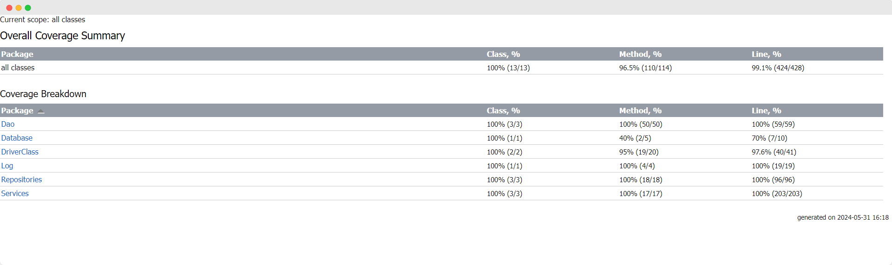

# TEST DRIVEN DEVELOPMENT

## Overview
This Library Management System is a comprehensive application designed to efficiently manage the operations of a library. It handles all the essential tasks related to books, users, and transactions. The system is built to support various functionalities such as adding, updating, and removing books, managing user registrations and updates, and handling book checkouts, returns, and renewals.

The system is divided into three main modules: Book Management, User Management, and Transaction Management. Each module encapsulates specific functionalities to ensure the system remains modular and easy to maintain. The Book Management module takes care of all book-related activities, the User Management module manages user data and operations, and the Transaction Management module handles the borrowing and returning of books. The use of these distinct modules ensures that the system is scalable and can be extended or modified as needed.

The application has a command-line interface (CLI), making it easy for users to navigate and perform different tasks. The system is also equipped with logging capabilities to track and record activities, which helps in monitoring and debugging.

To set the path for the log file, use the `SetLogFilePath` method in the Library Management System class.

## Features

### Book Management
- Add Book to Shelf
- Update Book Details
- Remove Book from Shelf
- Get Book Details

### User Management
- Register User
- Update User Details
- Delete User
- Get User Details

### Transaction Management
- Checkout Book
- Return Book
- Renew Book

## User Interface
After starting the application, you will see the following menu options:

```
--- Welcome to this amazing Library Management System ---
1. Add Book to Shelf
2. Update Book Details
3. Remove Book from Shelf
4. Get Book Details
5. Register User
6. Update User Details
7. Delete User
8. Get User Details
9. Checkout Book
10. Return Book
11. Renew Book
12. Exit
```

## Test Coverage Report
The test coverage report for the Library Management System provides a detailed overview of the extent to which the codebase is covered by automated tests. This report is located in the `TestCoverageReport` folder and can be viewed by opening the `index.html` file within that folder.

## Notes
Here, I mock all the classes present in the repositories directory as they directly deal with database operations. Additionally, for testing methods that depend on those repository classes, I mock the repository classes to return fake data from those functions. For the remaining logic, other than database operations, I wrote JUnit test cases.

Before I added the command-line interface to this system, I had a code coverage of 99.1%. After introducing the CLI, the coverage dropped to nearly 70%. Moreover, I did not write any test cases for this command-line interface.


## Test Coverage Report (Before Introducing CLI)
